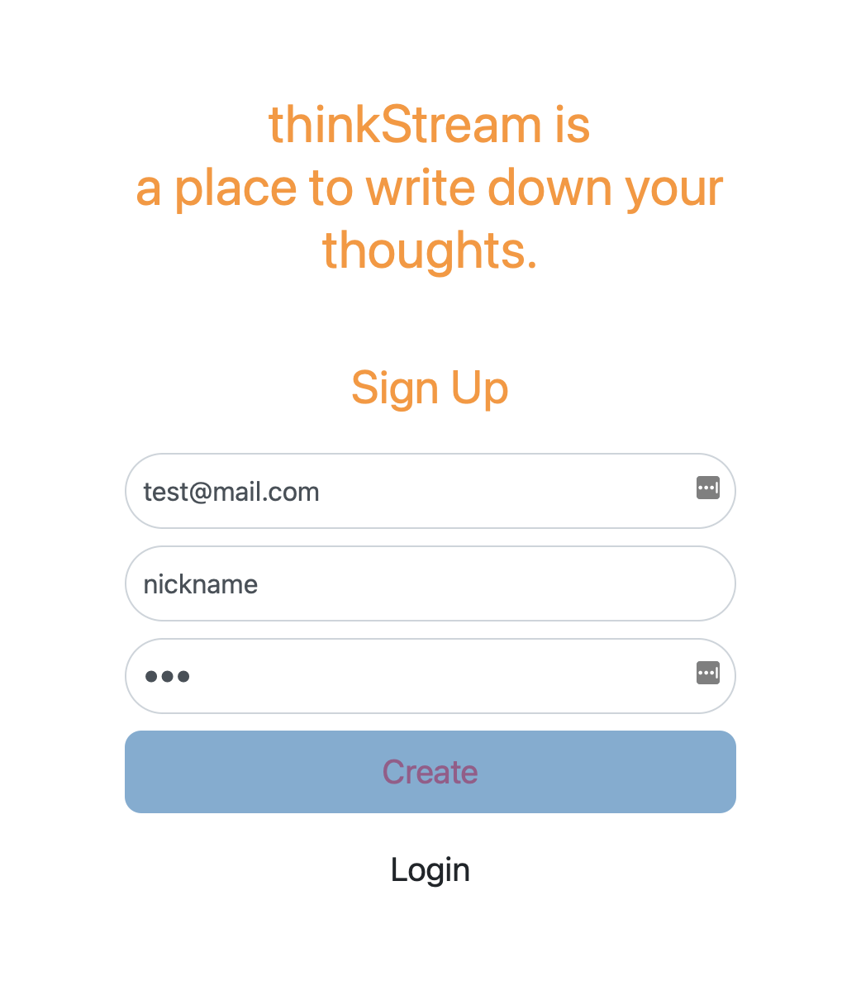
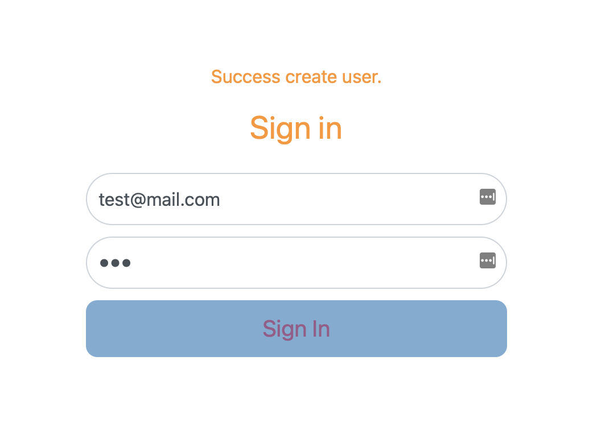
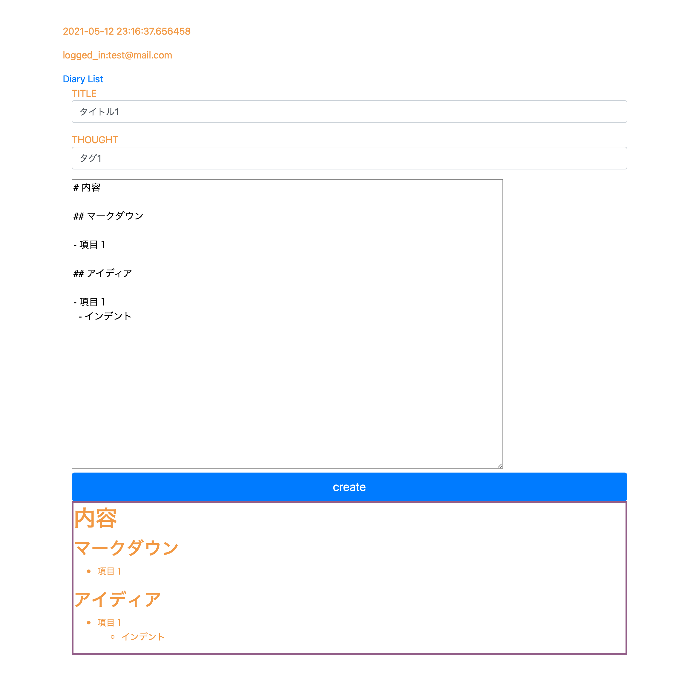
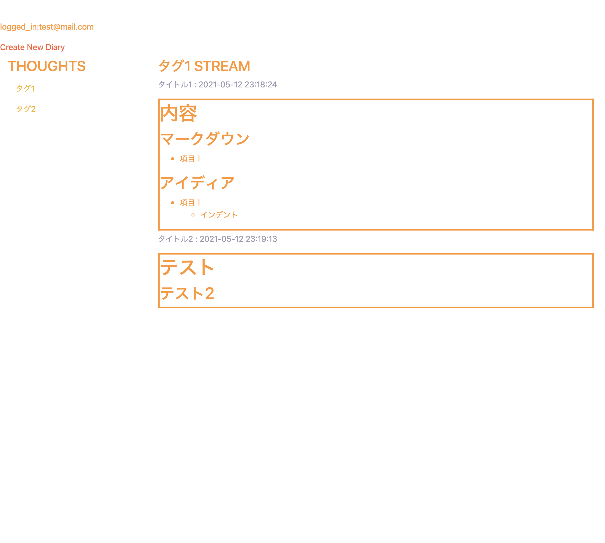

# thinkStream

## image

アカウント作成ができるトップページ  


ログインページ  


メモ作成ページ  


ログインユーザーが作成したメモ一覧ページ  


## Getting Started
---------------

```bash
// create secret files.
cd thinkStream_clone_path
echo "app_user $(pwgen -1 64)" | sudo tee ./secret/mysql_app_user
echo "root $(pwgen -1 64)" | sudo tee ./secret/mysql_root
pwgen -1 64 | sudo tee ./secret/authtkt_secret
pwgen -1 64 | sudo tee ./secret/signed_cookie_session_secret
```

```
// build and start. but, not access.
./start.sh dev
```

```bash
docker exec -it think_stream_db sh /usr/local/bin/create_db_user.sh
docker exec -it think_stream_web bash
// in container
RUN pip install -e .[develop]
// out
ctrl + D
```

```bash
docker-compose down
./start.sh dev
```

open http://localhost:8080


This software is released under the MIT License, see LICENSE.txt.

## 機能

- 認証、認可
- メモをmarkdownで書く
- カテゴライズ

## プラットフォーム

webアプリ

## 構成

### ミドルウェア

- apache
- mysql
- docker

### ライブラリ・フレームワーク

- bootstrap
- marked
- pyramid

### dockerコンテナ構成

- webapp = apache + python
- db = mysql

## 本番環境setup

```bash
sudo apt-get install pwgen
sudo curl -L https://github.com/docker/compose/releases/download/1.27.4/docker-compose-`uname -s`-`uname -m` -o /usr/local/bin/docker-compose
sudo chmod +x /usr/local/bin/docker-compose

# シークレットファイル作成
cd thinkStream_clone_path
echo "app_user $(pwgen -1 64)" | sudo tee ./secret/mysql_app_user
echo "root $(pwgen -1 64)" | sudo tee ./secret/mysql_root
pwgen -1 64 | sudo tee ./secret/authtkt_secret
pwgen -1 64 | sudo tee ./secret/signed_cookie_session_secret

# スワップ領域作成
sudo dd if=/dev/zero of=/var/swapvaol bs=1M count=4096
sudo mkswap /var/swapvaol
sudo swapon /var/swapvaol
sudo cat /proc/swaps

sudo ./start.sh
sudo docker exec -it think_stream_db sh /usr/local/bin/create_db_user.sh
```

## 起動

開発環境

```bash
cd thinkStream_path
./start.sh dev
curl http://localhost:8080
```

本番環境

```bash
cd thinkStream_path
./start.sh
curl http://localhost:80
```

[docker-compose.ymlの設定の共有について](https://docs.docker.jp/compose/extends.html#multiple-compose-files)

## デバッグログ出力

```
import logging
log = logging.getLogger(__name__)
log.debug(self.request)
```

## パス(ローカル)

```bash
# httpd.confのパス
less /usr/local/etc/httpd/httpd.conf
# mod_wsgiの設定
less /usr/local/etc/httpd/other/modwsgi.conf

# 文法チェック
/usr/local/Cellar/httpd/2.4.38/bin/apachectl configtest

# エラーログ
tail -f /var/log/apache2/error.log
```

## apache起動

```bash
# ホットリロード(開発用)
pserve development.ini --reload
# http://localhost:6543/edit
```

## pip

開発環境では `thinkStream.egg-info` がないと動かない
